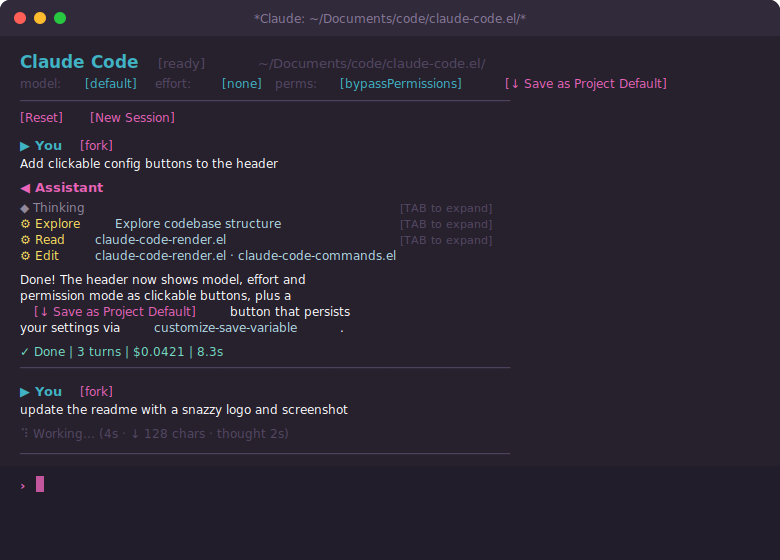

<p align="center">
  
</p>

<p align="center">
  An Emacs interface for Claude AI using the
  <a href="https://pypi.org/project/claude-agent-sdk/">Claude Agent SDK</a>.
</p>

<p align="center">
  
</p>

Features a magit-section conversation buffer with streaming output, collapsible
thinking/tool blocks, per-project configuration, org-roam context integration,
slash commands, message queuing, inline image rendering (vision), a stats
dashboard, an Emacs-native MCP tool layer for deep Emacs introspection, and a
treemacs-style agent sidebar for monitoring sessions and subagents.

## Architecture

```
┌─────────────────────────────────────────────────────────┐
│ Emacs                                                   │
│                                                         │
│  claude-code.el                                         │
│  ├── magit-section buffer (conversation UI)             │
│  ├── transient menu (keyboard-first commands)           │
│  ├── agent sidebar (treemacs-style session tree)        │
│  ├── process filter (JSON-lines parser)                 │
│  └── overlay-based thinking spinner                     │
│           │                                             │
│           │ stdin: JSON-line commands                    │
│           │ stdout: JSON-line events                    │
│           ▼                                             │
│  python/claude_code_backend.py                          │
│  ├── asyncio main loop (stdin reader)                   │
│  ├── typed protocol (dataclasses)                       │
│  ├── SDK message → protocol event conversion            │
│  ├── in-process MCP server (12 Emacs tools)             │
│  └── query dispatch + cancellation                      │
│           │                                             │
│           │ Claude Agent SDK                            │
│           ▼                                             │
│  claude-agent-sdk (pip package)                         │
│  ├── query() async iterator                             │
│  ├── built-in tools (Read/Write/Edit/Bash/Glob/Grep)   │
│  └── streaming via StreamEvent (raw SSE deltas)         │
│           │                                             │
│           │ HTTPS                                       │
│           ▼                                             │
│  Claude API                                             │
└─────────────────────────────────────────────────────────┘
```

## Source Files

The package is split into focused modules that load in dependency order via
`claude-code.el` (the main entry point).  When working on the codebase, check
this table first to identify which file to read or edit.

| File | Purpose | Depends on |
|------|---------|-----------|
| `claude-code-vars.el` | All `defcustom`, `defface`, `defvar`/`defvar-local` declarations, the `claude-code--def-key-command` macro, shared constants (`claude-code--thinking-frames`, `claude-code--slash-commands`), and Emacs-native subagent state vars (`claude-code--subagent-task-id`, `claude-code--subagent-parent-key`, `claude-code--subagent-has-worked`, `claude-code-enable-native-subagents`).  Faces include `claude-code-config-button` (header config value buttons) and `claude-code-action-button` (header action buttons).  Image config: `claude-code-inline-image-max-width`, `claude-code--pending-images`. | External: `magit-section`, `transient`, `cl-lib`, `json`, `project`, `seq` |
| `claude-code-agents.el` | Global agent registry (`claude-code--agents` hash), register/update/unregister/remove-child functions, parent–child tree helpers, the treemacs-style Agent Sidebar (`claude-code-agents-mode`), and per-task progress buffers (`claude-code-task-mode`).  Killing a subagent removes it from the parent's `:children` list and schedules a re-render of the parent session buffer. | `claude-code-vars`, `magit-section` |
| `claude-code-process.el` | UV/Python environment setup (`claude-code--ensure-environment`), backend process lifecycle (`claude-code--start-process`, `--stop-process`, `--send-json`), and the process filter/sentinel that parse JSON-lines output | `claude-code-vars` |
| `claude-code-config.el` | Session config merging (defaults → project overrides → session overrides via `claude-code--session-config`), org-roam project-notes/TODOs/skills loading, and `claude-code--build-system-prompt` (always injects the current Emacs buffer name so the agent can self-reference) | `claude-code-vars` |
| `claude-code-stats.el` | In-memory token/cost usage statistics.  Accumulates one entry per completed query in `claude-code--stats-entries` (global, not persisted across restarts).  Exposes `claude-code-stats-record!` (called by the events handler) and `claude-code-stats` (interactive entry point, also `/stats` slash command).  Renders `*Claude Stats*` in `claude-code-stats-mode` with ASCII bar charts and a cost sparkline. | `claude-code-vars`, `cl-lib`, `seq` |
| `claude-code-fringe.el` | Fringe indicators for Claude-touched lines in source buffers.  Defines fringe bitmaps (`claude-code-fringe-read`, `-write`, `-bash`) and faces.  Records which file lines were read/written/edited per session and applies left-fringe overlays to visiting buffers.  Hooked into the event handler alongside the pulse system. | `cl-lib` |
| `claude-code-events.el` | Dispatches backend events (`claude-code--handle-event`), handles status transitions, streaming deltas (text/thinking), task sub-agent events, Emacs-native subagent completion notifications (`claude-code--subagent-notify-parent`), and owns `claude-code--schedule-render` (debounced render timer).  Calls `claude-code-stats-record!` on each result event. | `claude-code-vars`, `claude-code-agents`, `claude-code-stats`, `claude-code-fringe` |
| `claude-code-render.el` | Full buffer rendering (`claude-code--render` and all `claude-code--render-*` helpers), text utilities (`claude-code--indent`, `--insert-linkified`), inline image display (`claude-code--insert-image`, `claude-code--image-type-from-media-type`), and the thinking-spinner animation (`claude-code--start-thinking`, `--stop-thinking`).  Calls `claude-code-lsp-link--linkify-region` at the end of linkification to buttonize LSP-known identifiers. | `claude-code-vars`, `claude-code-config`, `magit-section` |
| `claude-code-lsp-link.el` | LSP symbol linkification for inline code spans in responses.  Scans backtick-delimited identifiers, queries the project's LSP server (eglot or lsp-mode) via `:workspace/symbol`, and creates clickable buttons that jump to definitions.  Per-render symbol cache avoids redundant LSP round-trips.  Controlled by `claude-code-enable-lsp-links` customization. | `cl-lib` (optional: `eglot`, `lsp-mode`) |
| `claude-code-xwidget.el` | xwidget-webkit preview for HTML/SVG tool output.  Detects HTML (`<!DOCTYPE html`, `<html>`) and SVG (`<svg>`) content in tool results and adds a `[render]` button that opens the content in a side window via xwidget-webkit.  SVG is wrapped in a centered HTML document.  Gracefully degrades when xwidget-webkit is not available.  Controlled by `claude-code-xwidget-preview-enabled`. | `cl-lib` (optional: `xwidget`) |
| `claude-code-edit-result.el` | Editable tool results (wgrep-style).  Adds an `[edit]` button on tool result sections.  Opens a dedicated edit buffer; `C-c C-c` saves changes back to the in-memory conversation messages and re-renders, `C-c C-k` cancels.  Mutates the tool-result content in `claude-code--messages` in place so edits persist and Claude sees the corrected data on the next turn. | `cl-lib` |
| `claude-code-annotate.el` | Retroactive conversation annotations.  Attach notes to earlier ▶ You or ◀ Assistant turns via `C-c n` (`claude-code-annotate`).  Annotations stored in buffer-local alist keyed by message identity (`eq`), rendered inline as `[note] text (Xm ago)`.  `claude-code-delete-annotation` removes individual notes.  Survives re-renders since annotations live in data, not buffer overlays. | `claude-code-vars`, `magit-section` |
| `claude-code-dynamic-tools.el` | Agent-bootstrapped dynamic tool registry.  The agent can define an Emacs Lisp function mid-session via `EvalEmacs`, register it as a named tool via `CreateDynamicTool`, and invoke it on subsequent turns via `CallDynamicTool`.  Emacs side stores the registry for UI display (`claude-code-list-dynamic-tools`).  The agent's capability set grows through the conversation. | `cl-lib` |
| `claude-code-self-heal.el` | Self-healing render error recovery.  Advises `claude-code--render` with `condition-case` to catch errors, injects diagnostic messages into the conversation, and optionally auto-prompts the agent to diagnose and fix the rendering source.  Includes a periodic `*Messages*` buffer watcher that detects claude-code errors and surfaces them.  Configurable via `claude-code-self-heal-enabled`, `claude-code-self-heal-auto-prompt`, and `claude-code-self-heal-cooldown`. | `cl-lib` |
| `claude-code-ambient.el` | Ambient context from editor state.  Tracks the user's current file, cursor position, enclosing function (`which-function`), active region, and recent file list via an idle timer.  Prepends a `[Ambient context]` block to prompts so Claude knows what the user is looking at without explicit pasting.  Toggle with `claude-code-ambient-enabled`.  Configurable idle threshold and max region size. | `cl-lib` |
| `claude-code-adaptive.el` | Adaptive rendering from observed UI behaviour.  Advises `magit-section-toggle` and `claude-code-copy-code-block` to track expand/collapse patterns and code copies.  Idle timer records point dwell time per section type.  After sufficient observations (≥5 toggles, >80% collapse rate), automatically defaults that section type to collapsed.  `claude-code-adaptive-show-observations` displays stats; `claude-code-adaptive--summary` returns a string for agent consumption.  Toggle with `claude-code-adaptive-enabled`. | `cl-lib`, `magit-section` |
| `claude-code-ab-test.el` | Live A/B testing of output format.  Agent calls `claude-code-ab-test-start` with two rendered variants; Emacs splits the window side-by-side.  User presses `a` or `b` to choose; result stored in `claude-code-ab-test--history` and returned to the agent via callback.  `claude-code-ab-test-mode` provides the picker UI.  History viewable via `claude-code-ab-test-history`. | `cl-lib` |
| `claude-code-project-notes.el` | Auto-update project context notes from conversation outcomes.  After a configurable number of turns (`claude-code-project-notes-turn-threshold`, default 8), proposes updates to the org-roam project-context notes.  Hooks into `claude-code-result-hook`.  Modes: `on-ask` (default, M-x `claude-code-update-project-notes`), `on-idle` (prompts user), `auto` (sends silently).  Summarizes conversation and asks the agent to add new conventions, decisions, or patterns. | `cl-lib` |
| `claude-code-export.el` | Export conversations to org-mode or Markdown.  `claude-code-export` prompts for format and produces a clean document in a new buffer.  Also available as `/export` slash command. | `claude-code-vars`, `claude-code-render` |
| `claude-code-fork-tree.el` | Fork tree visualisation (`claude-code-fork-tree`, `claude-code-fork-tree-toggle`).  Shows the conversation DAG as a collapsible tree in a side window, highlighting the current branch with a `◀` marker.  Filters out task children to show only fork relationships.  Updates live via `claude-code-agents-update-hook`.  `claude-code-fork-tree-mode` derived from `magit-section-mode` with RET-to-jump navigation. | `claude-code-vars`, `claude-code-agents`, `magit-section` |
| `claude-code-commands.el` | All user-facing interactive commands (`claude-code-send`, `claude-code-cancel`, `claude-code-fork`, `claude-code-send-shell-output`, etc.), input area handling and history navigation, slash-command dispatch, session config setters (`claude-code-set-model`, `claude-code-set-effort`, `claude-code-set-permission-mode`), project config persistence (`claude-code-save-project-config`), image attachment (`claude-code-attach-image`, `claude-code--image-media-type`), shell output capture (`claude-code-send-shell-output`, also `/shell`), Emacs-native subagent spawning (`claude-code--spawn-subagent`), the `claude-code-menu` transient, keymap (`C-c i` for image attach, `F` for fork tree), `claude-code-mode` major mode definition, and the main entry points (`claude-code`, `claude-code-quick`, `claude-code-reload`).  `claude-code-reload` skips killing the backend process for sessions with a live process (e.g. the agent calling reload mid-tool-execution), updating only the keymap in-place via `use-local-map`. | `claude-code-vars`, `claude-code-agents`, `claude-code-process`, `claude-code-config`, `claude-code-events`, `claude-code-render`, `claude-code-export`, `claude-code-fork-tree` |
| `claude-code-git-graph.el` | Standalone git repository visualizer (`claude-code-git-graph`): 52-week contribution heatmap, top-contributors bar chart, and recent-commits log.  No dependency on the rest of the package. | `claude-code-vars` |
| `claude-code-frame-render.el` | Renders the live Emacs frame as an ANSI-decorated ASCII snapshot.  Public API: `claude-code-frame-render` (returns string) and `claude-code-frame-render-to-file`.  Used by the `EmacsRenderFrame` MCP tool so Claude can "see" the UI state.  Ported from `render-emacs.el` with all internal symbols namespaced under `claude-code-fr--`. | `cl-lib` |
| `claude-code-emacs-tools.el` | Emacs-side helpers invoked by the Python backend's MCP tools via `emacsclient --eval`.  Provides: `claude-code-tools-eval` (elisp eval with paren validation), `claude-code-tools-get-messages`, `claude-code-tools-get-buffer`, `claude-code-tools-list-buffers`, `claude-code-tools-search-forward/backward`, `claude-code-tools-goto-line`, `claude-code-tools-switch-buffer`, `claude-code-tools-get-point-info`, `claude-code-tools-get-debug-info`, `claude-code-tools-render-frame`. | `cl-lib`, `claude-code-frame-render` |
| `claude-code.el` | Package entry point — `require`s all modules above in load order and `provide`s `claude-code` | All of the above |
| `claude-code-test.el` | ERT test suite.  Run with `make test`. | `claude-code` |
| `python/claude_code_backend.py` | Async Python backend: reads JSON-line commands from stdin, calls the Claude Agent SDK, and writes JSON-line events to stdout.  Registers an in-process MCP server exposing 12 Emacs tools (`EvalEmacs`, `EmacsRenderFrame`, `EmacsGetMessages`, `EmacsGetDebugInfo`, `EmacsGetBuffer`, `EmacsGetBufferRegion`, `EmacsListBuffers`, `EmacsSwitchBuffer`, `EmacsGetPointInfo`, `EmacsSearchForward`, `EmacsSearchBackward`, `EmacsGotoLine`). | `claude-agent-sdk` (PyPI) |

### Module dependency graph

```
claude-code-vars
    ├── claude-code-agents
    │       └── (used by events, commands, process)
    ├── claude-code-process
    ├── claude-code-config
    │       └── claude-code-render
    ├── claude-code-stats
    ├── claude-code-fringe          ← fringe bitmaps for Claude-touched lines
    ├── claude-code-events
    │       ├── claude-code-stats (records query stats)
    │       ├── claude-code-fringe (records tool-use file touches)
    │       └── (uses render, commands — forward refs, resolved at runtime)
    ├── claude-code-lsp-link   ← LSP symbol linkification (eglot/lsp-mode)
    ├── claude-code-xwidget    ← xwidget-webkit HTML/SVG preview
    ├── claude-code-edit-result ← editable tool results (wgrep-style)
    ├── claude-code-annotate   ← retroactive conversation annotations
    ├── claude-code-export     ← conversation export (org/markdown)
    ├── claude-code-fork-tree  ← fork DAG visualisation (uses agents)
    ├── claude-code-commands   ← aggregates everything (incl. shell output capture)
    ├── claude-code-git-graph
    ├── claude-code-frame-render   ← Emacs frame → ANSI snapshot
    └── claude-code-emacs-tools    ← MCP tool helpers (uses frame-render)
```

Forward references (functions called across module boundaries at runtime, not
load time) are annotated with comments in the source.  They are safe because
`claude-code.el` loads all modules before any interactive command can be
invoked.

## Installation

### Prerequisites

- Emacs 30.0+
- Python 3.12+
- [uv](https://docs.astral.sh/uv/) (Python package manager)
- [Claude Code](https://claude.ai/download) installed and authenticated (uses your Claude.ai subscription — no API key needed)

### Setup

```bash
git clone https://github.com/kiranandcode/claude-code.el.git
```

The Python environment is set up **automatically** on first launch —
`claude-code.el` checks for `uv`, creates the virtualenv, and runs `uv sync`
if needed.  No manual `cd python && uv sync` required.

To force a dependency sync (e.g. after `git pull`), run `M-x claude-code-sync`.

If `uv` is not installed, the package will error immediately with a link to the
installation instructions instead of producing cryptic JSON parse failures.

### use-package + straight.el

```elisp
(use-package claude-code
  :straight
  (claude-code
   :type git
   :host github
   :repo "kiranandcode/claude-code.el"
   :files ("*.el" "python"))
  :commands (claude-code claude-code-quick claude-code-menu
             claude-code-send-region claude-code-reload
             claude-code-git-graph)
  :bind
  (("C-c l"     . claude-code)
   ("C-c L"     . claude-code-menu)
   ("C-c C-l r" . claude-code-reload)))
```

### use-package + vc (Emacs 30+)

```elisp
(use-package claude-code
  :vc (:url "https://github.com/kiranandcode/claude-code.el" :rev :newest)
  :commands (claude-code claude-code-quick claude-code-menu)
  :bind ("C-c l" . claude-code))
```

Emacs dependencies (`magit-section`, `transient`) are pulled automatically from MELPA.

## Usage

```
M-x claude-code       Open the Claude buffer for the current project
```

Type your prompt in the input area at the bottom and press `RET` to send.
`C-j` inserts a newline in the prompt.

Single-letter keys (`s`, `c`, `?`, etc.) are **context-aware**: they
self-insert when the cursor is in the input area and run commands when
the cursor is in the conversation above.

### Keyboard Shortcuts (in Claude buffer)

These shortcuts work when point is **outside the input area** (in the
conversation).  Inside the input area, all keys type normally.

| Key | Command | Description |
|-----|---------|-------------|
| `s` | `claude-code-focus-input` | Jump to input area |
| `RET` | `claude-code-return` | Submit prompt (in input area) or toggle section |
| `C-j` | `newline` | Insert newline in input area |
| `SPC` / `S-SPC` | — | Scroll up/down in conversation (or self-insert space in input area) |
| `DEL` | `claude-code-key-delete-backward` | Delete backward (input area) or scroll down |
| `r` | `claude-code-send-region` | Send region with a prompt |
| `c` | `claude-code-cancel` | Cancel running query |
| `C` | `claude-code-clear` | Clear conversation |
| `k` | `claude-code-kill` | Kill session and buffer |
| `R` | `claude-code-restart` | Restart backend (keeps conversation) |
| `a` | `claude-code-agents-toggle` | Toggle agent sidebar |
| `S` | `claude-code-sync` | Sync Python environment |
| `n` | `claude-code-open-notes` | Open the global notes org file |
| `d` | `claude-code-open-dir-notes` | Open/create project context notes (org-roam) |
| `o` | `claude-code-open-dir-todos` | Open/create project TODO list (org-roam) |
| `M-p` | `claude-code-previous-input` | Recall previous input (older) |
| `M-n` | `claude-code-next-input` | Recall next input (more recent) |
| `C-c i` | `claude-code-attach-image` | Attach image from clipboard or file |
| `TAB` | — | Slash-command completion (input area) or toggle section |
| `?` | `claude-code-menu` | Transient command menu |
| `q` | `quit-window` | Bury buffer |
| `G` | `claude-code--render` | Force re-render |

`t` (toggle thinking), `T` (toggle tool details), `W` (reset), `N` (new
session), and `f` (send file context) are available via the `?` transient menu,
not as direct buffer shortcuts.

### From Any Buffer

```
M-x claude-code-quick            ;; prompt in minibuffer, no buffer switch
M-x claude-code-send-region      ;; send selection with a question
M-x claude-code-send-buffer-file ;; send file path with a question
M-x claude-code-attach-image     ;; attach an image to the next prompt
```

### Slash Commands

Type `/` in the input area to trigger slash commands with auto-complete (via
`completion-at-point`, picked up automatically by `company` or `corfu`):

| Command | Action |
|---------|--------|
| `/clear` | Clear the conversation history |
| `/reset` | Hard-reset: clear all messages and restart the backend |
| `/new` | Open a new independent session for this directory |
| `/model` | Set the model for this session |
| `/effort` | Set the thinking effort level |
| `/notes` | Open the global notes file |
| `/project-notes` | Open or create project context notes |
| `/todos` | Open or create project TODO list |
| `/stats` | Show per-session token/cost statistics |
| `/inspect` | Show session state |
| `/help` | Show the transient command menu |

### Input History

Press `M-p` / `M-n` in the input area to cycle through previously submitted
prompts in the current session (like shell history):

- **`M-p`** — older input (back in history)
- **`M-n`** — newer input (forward in history)

Cycling past the newest entry restores whatever you had typed before you
started navigating.  If the agent is working, navigating history also updates
the queued message.

### Image Attachment (Vision)

Claude supports vision — you can attach images to any prompt and Claude will
describe, analyse, or reason about them.

#### Attaching an image

| Method | How |
|--------|-----|
| **Clipboard** (default) | Copy or screenshot any image → `C-c i` in the Claude buffer.  Grabs `image/png` from the system clipboard automatically. |
| **File** | `C-u C-c i` (prefix arg) → file picker.  Supports `.png`, `.jpg`/`.jpeg`, `.gif`, `.webp`. |
| **Transient menu** | `?` → Send → `i` |

Each attached image appears as a chip **above** the `>` prompt:

```
  📎 screenshot.png  [×]
> describe what you see
```

Click `[×]` (or delete the chip region) to remove an attachment before sending.
Multiple images can be attached; they are all sent with the next prompt and then
cleared.

#### Inline display (GUI Emacs)

When running in a graphical Emacs frame (`(display-graphic-p)` is non-nil),
images are rendered **inline** rather than as text chips:

- **Pending chips** (input area): thumbnail scaled to 200 px wide
- **Conversation history**: full image scaled to `claude-code-inline-image-max-width`
  pixels wide (default 480)

In a terminal frame the text chip fallback is used instead.  Set
`claude-code-inline-image-max-width` to `nil` to disable inline display
everywhere.

```elisp
;; Wider thumbnails (default 480)
(setq claude-code-inline-image-max-width 640)

;; Disable inline display entirely (text chips only)
(setq claude-code-inline-image-max-width nil)
```

#### Design decisions

- **Both `:raw-data` and `:data` stored**: pending images carry raw unibyte bytes
  (used by `create-image` for display) *and* a base64 string (used when
  serialising to JSON for the backend).  Only `:data` is ever sent over the wire.
- **`gui-get-selection 'CLIPBOARD 'image/png`**: on macOS NS Emacs this returns
  the raw PNG bytes from the pasteboard directly — no shell-out needed.  On other
  platforms the same call works for X11/Wayland clipboard images.
- **AsyncIterable prompt in the backend**: when images are present, the Python
  backend switches from a plain string prompt to an `AsyncIterable[dict]` that
  yields a single Anthropic API-format user message with image content blocks
  followed by the text block.  The SDK transparently handles both forms.
- **Images stored in message history**: the `images` key is saved in each user
  message alist so past turns render inline on every re-render (e.g. after
  `claude-code-reload`).

### Conversation Management

#### Reset and New Sessions

The buffer header displays clickable action buttons:

```
  [Cancel]  [Reset]  [New Session]
```

`[Cancel]` only appears while the agent is working.

- **`[Cancel]`** — cancels the running query (equivalent to `c`).  The
  conversation history is preserved; the queued message (if any) stays in the
  input area for editing.
- **`[Reset]`** — hard-resets the current conversation: clears all messages
  *and* restarts the backend process, giving you a blank slate.  Prompts for
  confirmation.  Also available as `W` in the `?` menu or the `/reset` slash
  command.
- **`[New Session]`** — opens a new, independent Claude buffer for the same
  directory without touching the current conversation.  Also available as `N` in
  the `?` menu or the `/new` slash command.  The new session appears in the
  Agent sidebar alongside the original.

#### Forking a Conversation

Each `▶ You` message heading has a `[fork]` button.  Clicking it (or pressing
`RET` on it) opens a new buffer pre-loaded with the conversation history *up to
and including* that message, then starts a fresh backend process.  This lets you
explore an alternative line of reasoning without losing the original thread.

You can also fork via `M-x claude-code-fork` when point is on a `▶ You`
heading.  Forked sessions appear in the Agent sidebar labelled `(fork)`.

### Message Queuing

If you press `RET` while the agent is still working, the message is **queued**
rather than sent immediately.  The text stays in the input area (edit it if
needed) and the spinner shows the queued text:

```
⠹ Working… (12s · ↓ 340 chars · thought 8s)
⏳ queued: your next message here
```

When the agent finishes, the queued message is sent automatically.  Press `c`
(cancel) to discard the queue — the text remains in the input area for editing.

### Thinking Spinner

The spinner now shows live stats while the agent works:

```
⠹ Working… (1m 45s · ↓ 558 chars · thought 88s)
```

- **elapsed** — wall-clock time since the query started
- **↓ N chars** — characters streamed so far (rough output size)
- **thought Xs** — time spent in thinking blocks

### Usage Statistics

`M-x claude-code-stats` (or `/stats` in the input area) opens a `*Claude Stats*`
buffer with a visual summary of all completed queries in the current Emacs session:

```
Claude Code — Usage Statistics
══════════════════════════════════════

  Queries completed: 14
  Total cost:        $0.2341
  Total turns:       47

  Cost per query (USD)

  0.042 ┤                             ██
  0.035 ┤              ██    ██       ██
  0.028 ┤     ██       ██    ██   ██  ██
  0.021 ┤     ██   ██  ██    ██   ██  ██  ██
  0.014 ┤  ██ ██   ██  ██ ██ ██   ██  ██  ██  ██
  0.007 ┤  ██ ██   ██  ██ ██ ██   ██  ██  ██  ██  ██
         Q1  Q2   Q3  Q4 Q5 Q6   Q7  Q8  Q9 Q10 …
```

Stats are accumulated in memory and reset on Emacs restart.  Press `q` to close.

### Agent Sidebar

Press `a` in the Claude buffer (or `M-x claude-code-agents-toggle`) to open a
treemacs-style side panel showing all active sessions and their subagents:

```
Claude Agents
──────────────────────────────────────

▾ ⠹ ~/projects/myapp        [working]
   Explain the auth module
   ⎘ *Claude: ~/projects/myapp*
  ├─ ⠹ Search codebase      [working]
  │    ⎘ *Claude Task: Search codebase*
  │    ⚙ Grep
  ├─ ✓ Read config files    [completed]
  │    Found 3 config files
  └─ ⠹ Analyze patterns     [working]

▸ ● ~/other-project          [ready]
   ⎘ *Claude: ~/other-project*
```

- **Root nodes** are sessions (one per project directory)
- **Child nodes** are subagents spawned by the main agent
- **▾ / ▸** fold indicator — `TAB` collapses/expands session nodes
- **`⎘ buffer-name`** shows the Emacs buffer each agent lives in
- `RET` / click on a session node → jump to its conversation buffer
- `RET` / click on a task node → jump to its dedicated task progress buffer
- `k` kill agent (on task nodes: cancels the whole parent session), `g` refresh, `q` close

The sidebar auto-updates as agents start, make progress, and complete.
Sessions resume their conversation context across `claude-code-reload`.

Task progress buffers (`claude-code-task-mode`) also show a `[Cancel]` button in their
header and bind `c` / `C-c C-c` to cancel the parent session — so you can interrupt
a running subagent without opening the sidebar.

#### Emacs-Native Subagents

When `claude-code-enable-native-subagents` is non-nil (the default), the
system prompt teaches Claude how to spawn **Emacs-native subagents** — full
`claude-code-mode` session buffers that run concurrently and are visible in
the `*Claude Agents*` sidebar.

Claude spawns them via `emacsclient` in the Bash tool:

```sh
emacsclient --eval '(claude-code--spawn-subagent "PARENT-BUF" "Description" "Prompt")'
```

The call:
1. Creates a new `claude-code-mode` buffer for the subagent.
2. Registers it as a task child of the parent session in the agent registry.
3. Pre-queues the prompt so the backend sends it the moment it is ready.
4. Pushes an info message into the parent session when the subagent completes.
5. Returns a `"emacs-task-…"` task ID that emacsclient echoes back.

This differs from the SDK's built-in sidechain subagents: each Emacs-native
subagent is a **first-class, inspectable Emacs buffer** — you can click into
it in the sidebar, read its conversation, and even interact with it directly.

#### Emacs-Native MCP Tools

The Python backend registers an **in-process MCP server** that exposes 12
Emacs-introspection tools to Claude at query time.  These are automatically
available in every session — no configuration required.

| Tool | What it lets Claude do |
|------|------------------------|
| `EvalEmacs` | Evaluate arbitrary Emacs Lisp (with paren validation) |
| `EmacsRenderFrame` | Capture an ANSI screenshot of the current Emacs frame |
| `EmacsGetMessages` | Read the `*Messages*` buffer (for errors/debug output) |
| `EmacsGetDebugInfo` | Get a combined `*Backtrace*` + `*Messages*` snapshot |
| `EmacsGetBuffer` | Read any buffer's text content |
| `EmacsGetBufferRegion` | Read a specific line range from a buffer |
| `EmacsListBuffers` | List all live buffers with mode and file info |
| `EmacsSwitchBuffer` | Switch the active buffer |
| `EmacsGetPointInfo` | Get cursor position + surrounding context |
| `EmacsSearchForward` | Regexp search forward (moves point) |
| `EmacsSearchBackward` | Regexp search backward (moves point) |
| `EmacsGotoLine` | Jump to a specific line number |

MCP tool calls appear in the conversation with an `[Emacs]` badge and a
`claude-code-mcp-tool-name` face to distinguish them from built-in SDK tools
(e.g. `Read`, `Bash`).  The `[view]` button on their result headings pops the
full output in a read-only buffer.

### Git Graph

`M-x claude-code-git-graph` opens a read-only buffer showing a visual summary
of a git repository's history — useful for getting a quick sense of a project
before diving in:

```
  ██ myapp  ·  branch: main  ·  1 234 commits total

  Contribution Activity — last 52 weeks

        Jan         Feb         Mar     …
  Su  ░░░░░░██░██░░░███░░░░░░░░░░██████
  Mo  ░░░░░░██░██░░░███░░░░░░░░░░██████
  Tu  ░░░░░░██░██░░░███░░░░░░░░░░██████
  …

  Less ░▒▓█ More

  Top Contributors

  Alice Johnson          ████████████████████ 412
  Bob Smith              ██████████░░░░░░░░░░ 201
  …

  Recent Commits

  a1b2c3d  2 hours ago   (main) Fix login redirect — Alice Johnson
  d4e5f6a  yesterday     Add password reset flow — Bob Smith
  …
```

The buffer shows:

- **Contribution heatmap** — 52-week commit activity grid (Sun–Sat rows,
  one column per week), colour-coded by commit density
- **Top contributors** — bar chart of the top 10 authors by all-time commit count
- **Recent commits** — last 20 commits with short SHA, relative date, branch/tag
  refs, message, and author

| Key | Action |
|-----|--------|
| `g` | Refresh |
| `q` | Close |
| `n` / `p` | Move down / up |

You can call it from anywhere — it is not tied to a Claude session:

```
M-x claude-code-git-graph      ;; prompts for repo directory
```

## Configuration

```elisp
;; Global defaults (nil means use the SDK/API default)
(setq claude-code-defaults
      '((model            . nil)
        (effort           . nil)
        (permission-mode  . "bypassPermissions")
        (max-turns        . 50)
        (max-budget-usd   . nil)
        (allowed-tools    . ("Read" "Write" "Edit" "Bash" "Glob" "Grep"
                             "WebSearch" "WebFetch"))
        (betas            . nil)))

;; Per-project overrides
(setq claude-code-project-config
      '(("~/work/prod-app" . ((model . "claude-opus-4-6")
                               (effort . "high")
                               (permission-mode . "acceptEdits")))
        ("~/scratch"        . ((model . "claude-haiku-4-5")
                               (effort . "low")))))

;; Org file with notes included in every system prompt
(setq claude-code-notes-file "~/org/claude-notes.org")

;; Python command (default: "uv")
(setq claude-code-python-command "uv")

;; Show thinking/tool blocks expanded by default
(setq claude-code-show-thinking nil)
(setq claude-code-show-tool-details nil)

;; Agent sidebar width (default: 40)
(setq claude-code-agents-sidebar-width 40)

;; Emacs-native subagent spawning (default: t)
;; When non-nil, Claude is instructed on how to spawn subagents as full
;; Emacs session buffers (visible in the *Claude Agents* sidebar) instead
;; of relying on the opaque CLI sidechain mechanism.
(setq claude-code-enable-native-subagents t)
```

### Session Overrides

The header shows the active model, effort, and permission mode as **clickable
buttons**.  Click any of them (or press `RET` on them) to change the value for
the current session via `completing-read`:

```
model: [claude-sonnet-4-6]  effort: [none]  perms: [bypassPermissions]  [↓ Save as Project Default]
```

The same setters are available via the transient menu (`?` → Session):

| Key | Command |
|-----|---------|
| `m` | Set model |
| `e` | Set effort |
| `p` | Set permission mode |
| `P` | Save as project default |

**Saving to project config:** clicking `[↓ Save as Project Default]` (or
pressing `P` in the menu) calls `claude-code-save-project-config`, which:

1. Reads the current effective model/effort/permission-mode.
2. Upserts an entry for the session directory in `claude-code-project-config`.
3. Persists the change via `customize-save-variable` so it survives Emacs restarts.

### Org-Roam Integration

If you use [org-roam](https://www.orgroam.com/), claude-code.el stores two
kinds of context as org-roam notes and merges them into every system prompt:

| Kind | Scope | What it's for |
|------|-------|---------------|
| **Skills** | Global | Reusable instructions/preferences included in *every* session |
| **Project notes** | Per-directory | Context specific to one project (architecture, conventions, etc.) |

Both are plain org-roam notes, live in your `org-roam-directory`, and take
effect on the next prompt — no restart needed.

#### Skills

```elisp
;; Customization (all optional — defaults work out of the box)
(setq claude-code-org-roam-skills-hub-title "Claude Code Skills") ;; hub note title
(setq claude-code-org-roam-skill-tag "claude_skill")              ;; filetag on skill notes
(setq claude-code-org-roam-skill-property "CLAUDE_SKILL")         ;; property identifying skills
```

**Commands:**

| Command | Key | Description |
|---------|-----|-------------|
| `claude-code-org-roam-add-skill` | `A` (in `?` menu) | Create a new skill note and link it to the hub |
| `claude-code-org-roam-visit-skills-hub` | `N` (in `?` menu) | Open the skills hub index note |

Each skill is an org-roam note with the `CLAUDE_SKILL` property set to `t`.
The hub note is created automatically on first use and indexes all skills.
At prompt time, all skill bodies are concatenated into the system prompt.

**Example workflow:**

```
M-x claude-code-org-roam-add-skill RET
  Skill name: emacs-ui-testing
  Skill description: When testing UI changes, use emacsclient to ...
```

#### Project Notes & TODOs

Per-project context and task lists are each stored as an org-roam note.  Two
separate notes are supported:

| Note type | Property | Command | Key |
|-----------|----------|---------|-----|
| Context/architecture | `CLAUDE_PROJECT_DIR` | `claude-code-open-dir-notes` | `d` |
| TODO list | `CLAUDE_PROJECT_TODOS` | `claude-code-open-dir-todos` | `o` |

Both are included in the system prompt when Claude runs in the matched
directory, giving the agent awareness of project context and current tasks.
The agent can read and update the TODO org file directly via `emacsclient`.

Per-project context is stored as an org-roam note identified by the
`CLAUDE_PROJECT_DIR` property set to the expanded project path.  The note
body is injected into the system prompt whenever Claude runs in that
directory (or any subdirectory — matching is longest-prefix, so one note
for `~/org` also covers `~/org/roam` and deeper paths).  Notes live in
your `org-roam-directory` — nothing is written into the project repository
itself.

```elisp
;; Customization (optional)
(setq claude-code-org-roam-project-dir-property   "CLAUDE_PROJECT_DIR")
(setq claude-code-org-roam-project-todos-property "CLAUDE_PROJECT_TODOS")
```

**Commands:**

| Command | Key | Description |
|---------|-----|-------------|
| `claude-code-open-dir-notes` | `d` / `d` in `?` menu | Open or create the project-context note for the current session directory |
| `claude-code-open-dir-todos` | `o` / `o` in `?` menu | Open or create the project TODO list for the current session directory |

**Example workflow:**

```
;; In a Claude buffer for ~/work/myapp, press d (or ? → d)
;; → Creates an org-roam note titled "Project context: ~/work/myapp"
;; → Opens it for editing
;; → Its body is included in every prompt sent from that directory or below
```

The note is pre-populated with a starter template on first creation.  Edit
it freely — add architecture notes, conventions, links to key files, or
anything else that helps Claude understand the project.

## Troubleshooting

### Backend crashes / stops responding

If Claude stops responding to prompts, the backend process likely died.
You'll see a message in the buffer:

```
  ℹ Backend process exited: finished.  Press R to restart.
```

**Press `R`** (or `M-x claude-code-restart`) to restart the backend while
keeping your conversation history.  The next prompt you send will start a
fresh Agent SDK session.

If you didn't notice the crash and just see prompts being silently ignored,
`claude-code--send-json` will auto-restart the backend on the next send
attempt.  You can also use `M-x claude-code-inspect` to check the session
state — look for `process: nil` or `status: stopped`.

### Common causes

- **Stale session resume**: if the backend process restarts (or you reload
  the package), the old session ID becomes invalid.  The backend now retries
  without `resume` automatically when this happens.
- **`cwd` is nil**: can happen after a manual `load-file` reload (which
  resets buffer-local variables).  `claude-code-restart` recovers `cwd`
  from `project-current` or `default-directory`.  Prefer `M-x
  claude-code-reload` which preserves all state.

## Buffer Layout

```
Claude Code  [working]  ~/projects/myapp
  model: [default]  effort: [none]  perms: [bypassPermissions]  [↓ Save as Project Default]
──────────────────────────────────────────────────────────────────────────
  [Reset]  [New Session]   (+ [Cancel] while working)
▶ You  [fork]
  [inline image: screenshot.png 480×320]  screenshot.png (480x320)
  Explain the auth module

◀ Assistant
  ◆ Thinking                                              [TAB to expand]
  ⚙ Read src/auth.py                                      [TAB to expand] [view]
  ⚙ Grep pattern=verify_token                              [TAB to expand] [view]
  [Emacs] ⚙ EvalEmacs (require 'cl-lib)                   [TAB to expand] [view]

  The authentication module handles JWT verification...

  ✓ Done | 3 turns | $0.0142 | 4.2s
──────────────────────────────────────────────────────────────────────────

  ⠹ Thinking...

──────────────────────────────────────────────────────────────────────────
  📎 screenshot.png  [×]        ← pending image chip (thumbnail in GUI)
> your prompt here
```

- **Config buttons** — `[model]`, `[effort]`, and `[perms]` in the header are clickable; click to change the value for this session via `completing-read`
- **`[↓ Save as Project Default]`** — persists the current model/effort/permission-mode to `claude-code-project-config` for this directory and saves to your Emacs custom file
- **Header buttons** — `[Cancel]` (while working), `[Reset]`, and `[New Session]` are clickable; click or press `RET` to activate
- **`[fork]` button** — appears on every `▶ You` heading; forks the conversation at that message
- **Thinking blocks** — collapsed by default, toggle with `TAB`
- **Tool-use blocks** — collapsed; heading shows tool name + summary (file path, grep pattern, etc.); `[view]` button pops the full tool result in a read-only buffer (press `q` to close)
- **`[Emacs]` badge** — Emacs-native MCP tool calls (e.g. `EvalEmacs`, `EmacsRenderFrame`) are highlighted with a distinct `[Emacs]` badge so they stand out from built-in SDK tools
- **Streaming** — text appears token-by-token; thinking spinner animates via overlay
- **Links** — URLs open in browser; absolute file paths open in Emacs

## Protocol

Emacs and the Python backend communicate over stdin/stdout using one JSON object per line.

### Commands (Emacs → Python)

| Command | Fields | Description |
|---------|--------|-------------|
| `query` | `prompt`, `cwd`, `allowed_tools`, `system_prompt`, `max_turns`, `permission_mode`, `model`, `effort`, `max_budget_usd`, `betas`, `resume`, `images` | Send a prompt to the agent |
| `cancel` | — | Cancel the running query |
| `quit` | — | Shut down the backend |

### Events (Python → Emacs)

| Event | Key fields | Description |
|-------|------------|-------------|
| `status` | `status`: ready/working/cancelled/error | Backend lifecycle |
| `system` | `subtype`, `data` | SDK system messages (e.g. session init with `session_id`) |
| `assistant` | `content[]`, `model` | Complete assistant turn with content blocks |
| `result` | `result`, `stop_reason`, `is_error`, `num_turns`, `total_cost_usd`, `duration_ms`, `session_id` | Final query result |
| `error` | `message`, `detail` | Error with optional traceback |
| `content_block_start` | `index`, `block_type` | A streaming content block begins |
| `text_delta` | `index`, `text` | Incremental text token |
| `thinking_delta` | `index`, `thinking` | Incremental thinking token |
| `input_json_delta` | `index`, `partial_json` | Incremental tool input JSON |
| `content_block_stop` | `index` | A streaming content block ends |
| `task_started` | `task_id`, `description` | Subagent task began |
| `task_progress` | `task_id`, `description`, `last_tool_name` | Subagent progress |
| `task_notification` | `task_id`, `status`, `summary` | Subagent completed/failed |
| `rate_limit` | `message` | Rate limit warning |

Content blocks within `assistant` events:

| Block type | Fields | Description |
|------------|--------|-------------|
| `text` | `text` | Assistant text output |
| `thinking` | `thinking` | Internal reasoning (collapsible in UI) |
| `tool_use` | `id`, `name`, `input` | Tool invocation (collapsible, shows summary) |
| `tool_result` | `tool_use_id`, `content`, `is_error` | Tool execution result |

All protocol types are defined as Python dataclasses in `python/claude_code_backend.py` and enforced by `mypy --strict`.

## Debugging & Introspection

### `M-x claude-code-inspect`

Opens a read-only buffer showing session state at a glance:

```
claude-code session state
══════════════════════════════════════
  buffer:     *Claude: ~/my-project/*
  cwd:        ~/my-project/
  status:     ready
  session-id: 80549b18-...
  process:    run
  messages:   42 total, 8 user, 4 results
  cost:       $0.1234

Last query command keys: (resume system_prompt max_turns ...)
Has system prompt: yes
Has resume: yes

User prompts (newest first):
  - fix the login bug
  - what does auth.py do
```

### Buffer-local variables

Every Claude buffer exposes these for programmatic access (e.g. via `emacsclient`):

| Variable | Description |
|----------|-------------|
| `claude-code--messages` | All messages (newest first). Each is an alist with `type` key. |
| `claude-code--session-id` | Current Agent SDK session ID (used for `resume`). |
| `claude-code--status` | Symbol: `starting`, `ready`, `working`, `error`, `stopped`. |
| `claude-code--cwd` | Working directory for this session. |
| `claude-code--last-query-cmd` | The last JSON command alist sent to the backend. |

Example via emacsclient:

```sh
# Check session state
emacsclient --eval '(with-current-buffer "*Claude: ~/my-project/*"
  (format "status=%s session=%s msgs=%d"
          claude-code--status claude-code--session-id
          (length claude-code--messages)))'

# Get last 5 user prompts
emacsclient --eval '(with-current-buffer "*Claude: ~/my-project/*"
  (mapcar (lambda (m) (alist-get (quote prompt) m))
          (seq-take (seq-filter
                     (lambda (m) (equal "user" (alist-get (quote type) m)))
                     claude-code--messages) 5)))'

# Check if resume was sent in last query
emacsclient --eval '(with-current-buffer "*Claude: ~/my-project/*"
  (alist-get (quote resume) claude-code--last-query-cmd))'
```

### Conversation persistence

Each query sends the `resume` field with the session ID from the previous
response.  This tells the Agent SDK to continue the same conversation,
preserving full history on the server side.  If Claude seems to "forget"
previous turns, check `claude-code--last-query-cmd` to verify `resume` is
present.

## Development

A convenience script `emacs-batch.sh` launches Emacs in `--batch` mode with all
dependencies resolved from the `Cask` file via `dev/resolve-deps.el`:

```bash
# Byte-compile
./emacs-batch.sh -f batch-byte-compile claude-code.el

# Evaluate a snippet
./emacs-batch.sh --eval '(progn (require (quote claude-code)) (message "ok"))'

# Run all checks (uses emacs-batch.sh internally)
make all                   # checkdoc + byte-compile + ERT tests + mypy --strict
make test                  # just the ERT tests
```

Inside Emacs:

```
M-x claude-code-reload     ;; reload source, keep conversation (preserves live backend)
M-x claude-code-sync       ;; force uv sync after pulling new deps
M-x claude-code-inspect    ;; show session state for debugging
```

## License

Apache License 2.0
